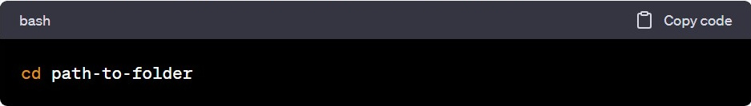

Sure, here's the step-by-step guide on how to run a React script from a GitHub
repository:

1. **Clone the Repository:**

   - Open the GitHub repository page where the React application is located.
   - Click on the "Code" button.
   - Copy the repository URL.

2. **Terminal Commands:**

   - Open your terminal on your computer.
   - Navigate to the directory where you want to place your project:

   

   - Run the `git clone` command to clone the repository. Replace
     `repository-URL` with the copied URL:

   

   - Move into the project folder:

     

3. **Install Dependencies:**

   - Inside the project folder, run the command to install the dependencies:

     

4. **Run the React Application:**

   - After the dependencies are installed, run the command to start the React
     application:

     

5. **View the Application:**
   - A web browser will automatically open a new tab with the running React
     application.
   - The application will be accessible at `http://localhost:3000`.

This is a basic guide to run a React application from a GitHub repository.
Please note that additional configurations or commands might be required to run
the application, especially if the project uses specific libraries or
configurations. Also, make sure to refer to any documentation or instructions
provided in the repository to ensure you're following the correct steps.
